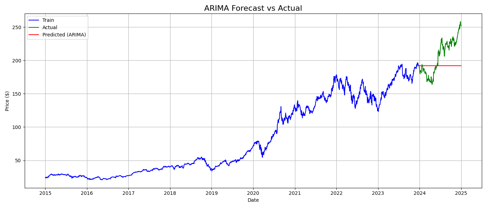

# 📈 Time Series Analysis and Forecasting for Stock Market

This project focuses on analyzing and forecasting the stock prices of Apple Inc. (AAPL) using historical data and the ARIMA time series model. It is completed as part of a **Data Science and Analytics Internship** with **ZIDIO DEVELOPMENT**.

---

## 📁 Project Structure

ZIDIO/
├── data/

│ └── AAPL_stock.csv # Collected stock data (2015–2024)

├── notebooks/

│ ├── 1_data_collection.py # Download data using yfinance

│ ├── 2_preprocessing_visuals.py # Clean data & visualize trends

│ └── 3_arima_forecasting.py # Forecast prices using ARIMA
├── 4_forecast_sarima.py # Seasonal ARIMA

│ ├── 5_forecast_prophet.py # Prophet model

│ └── 6_forecast_lstm.py # LSTM deep learning model

├── visuals/

│ ├── close_price_plot.png # AAPL closing price plot

│ └── arima_forecast.png # ARIMA forecast vs actual

├── sarima_forecast.png # SARIMA forecast

│ ├── prophet_forecast.png # Prophet forecast

├── .venv/ # Python virtual environment (optional)

└── README.md # Project documentation

---

## 📊 Visual Outputs

### 🔹 AAPL Closing Price Over Time

---

### 🔹 ARIMA Forecast vs Actual

### 🔹 SARIMA Forecast vs Actual

### 🔹 Prophet Forecast vs Actual

---

## 🚀 How to Run the Project

### 1. Open terminal in the root folder (`ZIDIO`) and install requirements:

pip install yfinance pandas matplotlib statsmodels scikit-learn
2. Run the scripts in order:
python notebooks/1_data_collection.py
python notebooks/2_preprocessing_visuals.py
python notebooks/3_arima_forecasting.py
python notebooks/4_forecast_sarima.py
python notebooks/5_forecast_prophet.py

📈 Model Details

Model: ARIMA (5, 1, 0)

SARIMA – seasonal pattern extension

Prophet – handles trend + seasonality

Data Period: Jan 2015 – Dec 2024

Forecast Window: Last 10% of the data

Metric Used: Root Mean Squared Error (RMSE)

🛠️ Tools & Libraries

Python 3.x

yFinance

Pandas, NumPy

Matplotlib

Prophet

Statsmodels (ARIMA)

scikit-learn

📬 Acknowledgements

📉 Data Source: Yahoo Finance

🎓 Internship: Zidio Development – Data Science and Analytics Program
