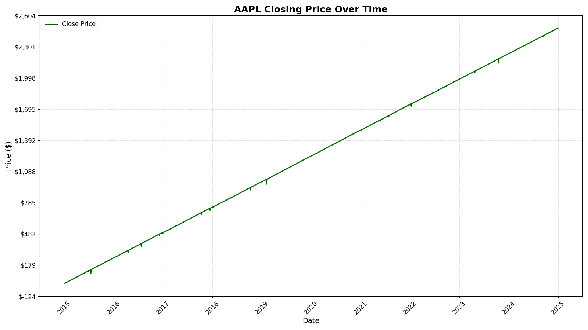

# 📈 Time Series Analysis and Forecasting for Stock Market

This project focuses on analyzing and forecasting the stock prices of Apple Inc. (AAPL) using historical data and the ARIMA time series model. It is completed as part of a Data Science and  Analytics Internship with **ZIDIO DEVELOPMENT**.

---

## 📁 Project Structure

ZIDIO/
├── data/

│ └── AAPL_stock.csv # Collected stock data (2015–2024)

├── notebooks/

│ ├── 1_data_collection.py # Download data using yfinance

│ ├── 2_preprocessing_visuals.py # Clean data & visualize trends

│ └── 3_arima_forecasting.py # Forecast prices using ARIMA

├── visuals/

│ ├── close_price_plot.png # AAPL closing price plot

│ └── arima_forecast.png # ARIMA forecast vs actual

├── .venv/ # Python virtual environment (optional)

└── README.md # Project documentation

---

## 📊 Visual Outputs

### 🔹 AAPL Closing Price Over Time

---

### 🔹 ARIMA Forecast vs Actual

---

## 🚀 How to Run the Project

### 1. Open terminal in the root folder (`ZIDIO`) and install requirements:

pip install yfinance pandas matplotlib statsmodels scikit-learn
2. Run the scripts in order:
python notebooks/1_data_collection.py
python notebooks/2_preprocessing_visuals.py
python notebooks/3_arima_forecasting.py

📈 Model Details

Model: ARIMA (5, 1, 0)

Data Period: Jan 2015 – Dec 2024

Forecast Window: Last 10% of the data

Metric Used: Root Mean Squared Error (RMSE)

🛠️ Tools & Libraries

Python 3.x

yFinance

Pandas, NumPy

Matplotlib

Statsmodels (ARIMA)

scikit-learn

📬 Acknowledgements

📉 Data Source: Yahoo Finance

🎓 Internship: Zidio Development – Data Science and Analytics Program
